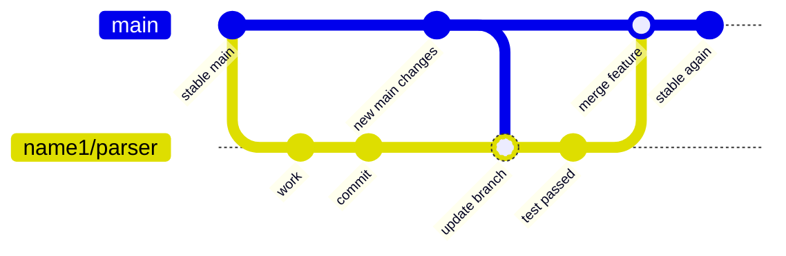
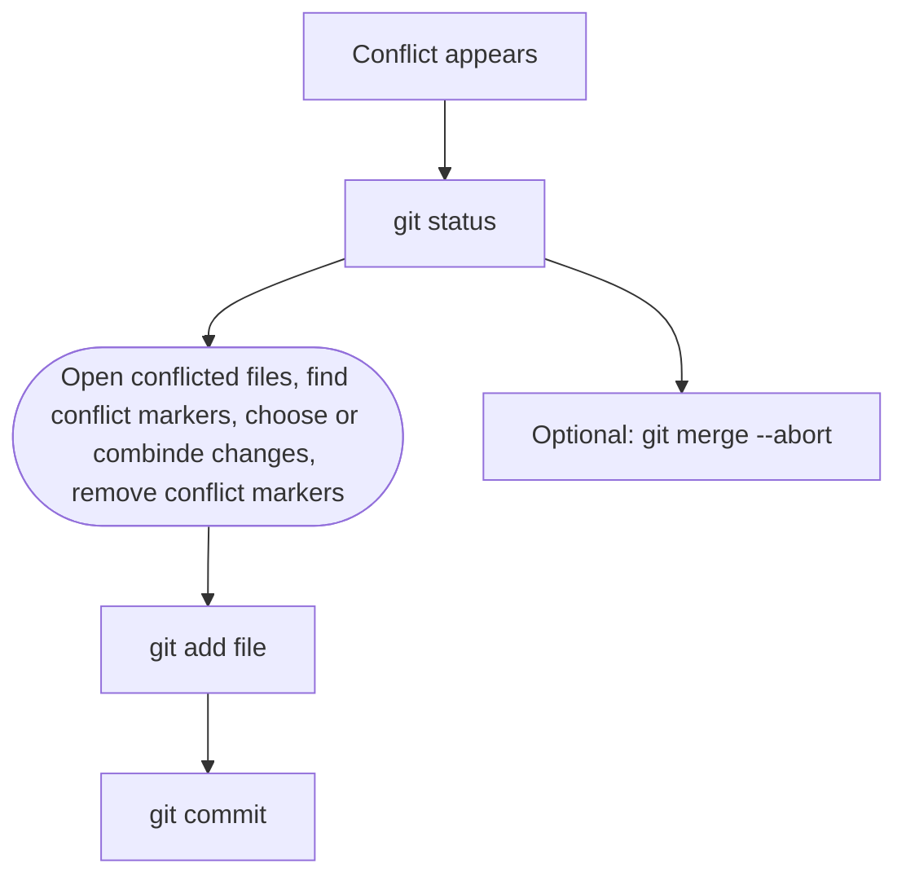

# Git Workflow

## Workflow overview



## Branch rules

- `main`: stable, tested, compilable code only.
- Feature branches: `<owner>/<feature-name>`.
- Before merging a feature into `main`, update the feature branch with `main`.
- Test the feature branch locally.
- If the test succeeds, merge the feature branch into `main`.

## Commit messages

Format:

```txt
VERB filename: description
```

Verblist:

```txt
CREATE		create new file
ADD			new code/content/function
EDIT		changed code/content
DEL			deleted or removed code/file
FIX			bug fix
NORM		formatting/norminette
DOC			documentation
```

Examples:

```bash
git commit -m "CREATE workflow.md: add git branch rules"
git commit -m "EDIT README.md: improve setup instructions"
```

## Daily routine

```shell
git checkout main	#Switch to the `main` branch.
git pull --ff-only origin main	#Get the latest remote `main` without creating an extra merge commit.
git checkout <branch-name>	#Switch back to your working branch.
git merge main	#Update your branch with the latest changes from `main`.
git status	#Show changed, staged, and untracked files.
git diff	#Review your changes before staging.
git add <file>	#Stage the file you want to commit.
git diff --staged	#Review what is staged for the commit.
git commit -m "VERB filename: description"	#Commit your staged changes with a clear message.
git push	#Push your branch to GitHub.
```

## New branch routine

```bash
git checkout main
git pull --ff-only origin main	#Update main
git checkout -b <owner>/<feature-name>	#create branch

# work, add, commit

git push -u origin <owner>/<feature-name>	#first push
```

After the first push:

```bash
git push
```

## Delete branch routine

After the branch was merged:

```bash
git checkout main
git pull --ff-only origin main
git branch -d <branch-name>
git push origin --delete <branch-name>
git fetch --prune
```

Force delete only when work on the branch was dismissed:

```bash
git branch -D <branch-name>
```

## Merge conflict routine



Conflict markers:

```txt
<<<<<<< HEAD
your changes
=======
incoming changes
>>>>>>> branch-name
```
